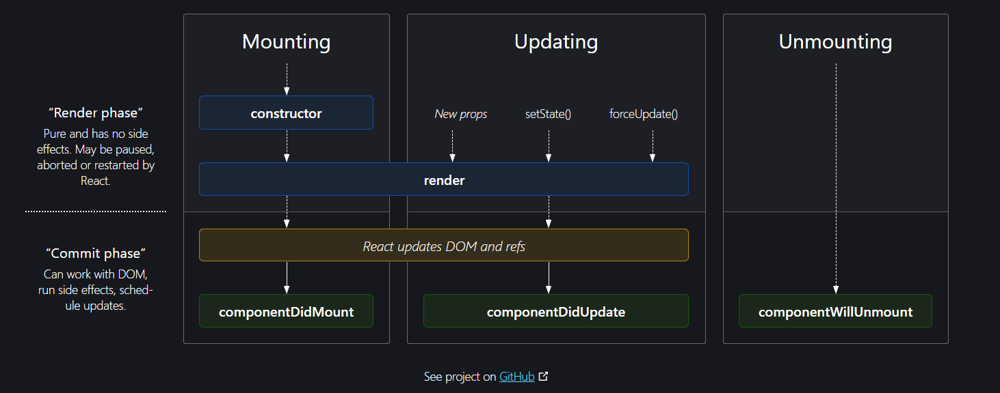

# Food Ordering App

# About the Project
* React Hooks
* CSR and SSR
* React's Lifecycle method workflow
* Custom Hooks
* Bundlers (Parcel and webpack)
* React Context
* Redux Architecture & workflow
* Testing the React App
* 
# React Hooks
- (Normal JS utility functions)
- useState() -superpowerful state variable
- useEffect() - to connect our app to external s/m.
  
# 2 types Routing in web apps

- Client Side Routing
- Server Side Routing

# React's lifecycle methods workflow

# Custom Hook
- custom utility function - spcl useCase 
- Single responsibility principle
- modularity -reusable, maintainable, testable,readable
- Abstract the fetching data(API call), and heavy loaded tasks inside the custom hook, so that it makes our code testable.
- maintain seperate file for each and every custom hook

# Bundling - in detail

- to break down the App into smaller chunks of code
- chunking
- code splittting
- dynamic bundling
- Ondemand loading
- Lazy loading
- Dynamic Import

# React Context
- when using redux, no need of context in React's App.
- no need of external data management libraries/ state management libraries
- useContext(),
- <UserContext.Consumer> - used inside class based components.
- <UserContext.Provider> - override the default values of the context

# Redux - Architecture & how it works
- Install @reduxjs/toolkit and react-redux
- Build our own store
- connect our store to our App
- Slice (cartSlice)
- dispatch(action)
- Selector

# Testing the React App

- 3 types of testing that developer can do
  a) Unit Testing - testing in Isolation
  b) Integration Testing -testing b/w integration of the components
  c) End to End Testing (E2E) - entire application testing

# Settings up Testing in our App

- Install React Testing Library
- Install jest
- Install Babel dependencies
- Configure Babel
- Configure Parcel config file to disable Default babel transpilation
- Jest - npx jest --init
- Install JsDom Library
- Install @babel/preset-react - to make jsx work in test cases
- Include @babel/preset-react inside my babel config
